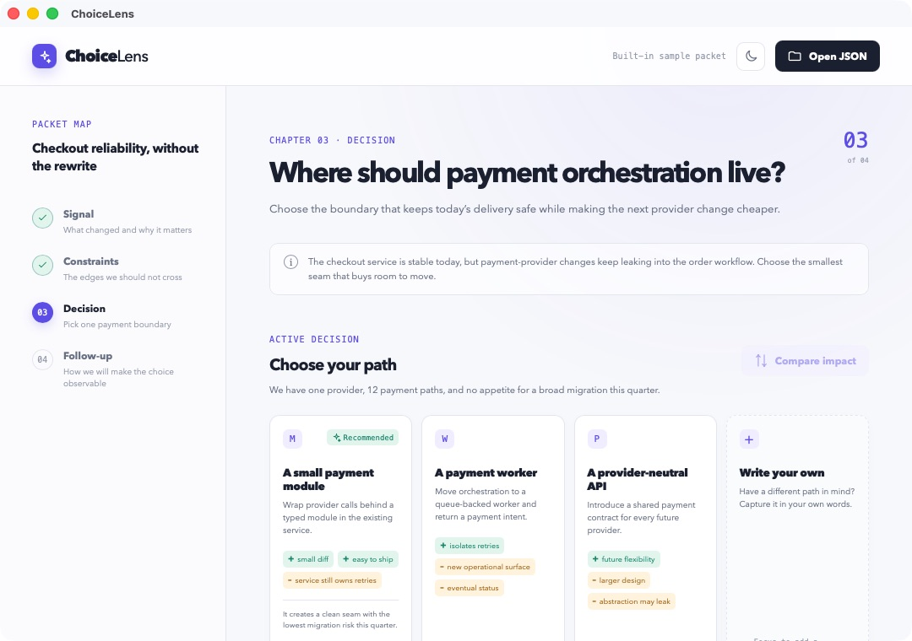

# ChoiceLens

ChoiceLens is a focused macOS companion app for [chapter-based guided development](https://github.com/xhqx/codex-learning-skills). It opens on a welcome page until a JSON decision packet is loaded, shows full-width option rows with impact previews, and writes the answer beside the packet. A loaded question automatically submits its recommendation after 60 seconds unless the user interacts with it or stops the timer.



## What it does

- Shows only a welcome page when no question is loaded; invalid startup packets show an error there.
- Presents two or three mutually exclusive choices in scrollable rows plus a custom-answer input.
- Marks exactly one recommendation and shows a 60-second automatic-answer countdown. Choosing an option, focusing custom input, opening details, stopping the timer, switching theme, or opening another question cancels it; Submit answer is then required.
- Displays optional before-and-after impact previews.
- Validates packets before display and answers before saving.
- Stores one sibling answer file. Repeating the same answer is idempotent; a different answer requires a new packet.

## Install the macOS app

The current prebuilt release supports Apple-silicon Macs (M1 or later).

The source on `main` is version 0.1.4. The older 0.1.0 download does not include the welcome page, timer, or current launch behavior; build from source for those changes.

1. Download `ChoiceLens-0.1.0-macos-arm64.zip` from the [latest release](https://github.com/xhqx/ChoiceLens/releases/latest).
2. Unzip the download.
3. Move `ChoiceLens.app` to one of these locations:
   - `~/.codex/tools/ChoiceLens.app` for use with the guided-development skill; or
   - `/Applications/ChoiceLens.app` for ordinary manual use.
4. Launch ChoiceLens. In 0.1.4, click **Open question** on the welcome page to select a decision packet. The [`sample-packet.json`](sample-packet.json) file is an optional demonstration, never an automatic fallback.

To install it in the Codex tools directory from Terminal:

```bash
mkdir -p "$HOME/.codex/tools"
ditto "/path/to/ChoiceLens.app" "$HOME/.codex/tools/ChoiceLens.app"
open "$HOME/.codex/tools/ChoiceLens.app"
```

When upgrading, quit ChoiceLens and move the previous app to the Trash before copying the new version.

### First-launch security notice

Version 0.1.0 is ad-hoc signed and is not notarized with Apple. macOS may block its first launch. In Finder, Control-click `ChoiceLens.app`, choose **Open**, and confirm **Open**. Do not disable Gatekeeper system-wide.

## Use it with Codex

Install the [`guided-development`](https://github.com/xhqx/codex-learning-skills/tree/main/skills/guided-development) skill and place ChoiceLens in `~/.codex/tools/ChoiceLens.app`.

The skill creates a unique packet for each real question, following the schema in [`sample-packet.json`](sample-packet.json). Store packets outside macOS-protected Documents locations. From the question directory, open each packet in its own instance:

```bash
open -n "$HOME/.codex/tools/ChoiceLens.app" --args /absolute/path/to/feature-choice.json
```

Select or write an answer and submit it, or let the 60-second timer submit the recommendation. ChoiceLens writes exactly one answer beside the original packet:

```text
feature-choice.json
feature-choice.answer.json
```

The answer contains either `selectedOptionId` or `customAnswer`. Codex must remain active while waiting, verify that the answer matches the packet, and then resume the same development chapter. A failed load, closed window, or missing answer is not a decision. Automatic submission does not replace explicit approval for actions that require it.

## Build from source

Requirements:

- macOS with Xcode Command Line Tools;
- Node.js 20 or newer;
- Rust stable toolchain.

Install dependencies and run the checks:

```bash
npm ci
npm test
npm run build
cargo test --workspace
```

Build the application bundle:

```bash
npm run tauri build
```

The macOS application is created at:

```text
target/release/bundle/macos/ChoiceLens.app
```

## Packet safety boundary

ChoiceLens accepts UTF-8 JSON packets up to 1 MiB. The Rust backend validates the schema, option IDs, trade-offs, recommendation count, and submitted answer. It reads only the packet selected by the user and writes a new answer file in the same directory. The app does not require a network connection.

## License

Released under the [MIT License](LICENSE).
